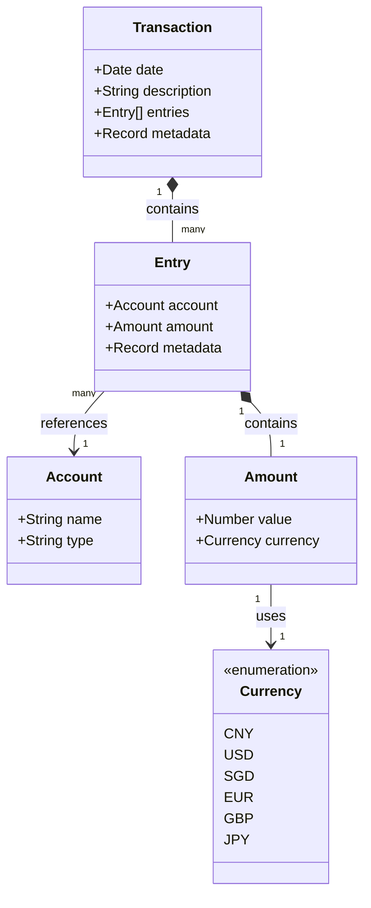

# 个人财务记账系统 - 领域模型和服务设计

## 1. 领域模型

### 1.1 核心实体

#### 1.1.1 交易(Transaction)

```typescript
interface Transaction {
  date: Date;
  description: string;
  entries: Entry[];
  metadata: Record<string, unknown>;
}
```

#### 1.1.2 账户(Account)

```typescript
type AccountType = 'Assets' | 'Liabilities' | 'Income' | 'Expenses' | 'Equity';

interface Account {
  name: string;
  type: AccountType;
}
```

#### 1.1.3 交易条目(Entry/Posting)

```typescript
interface Entry {
  account: Account;
  amount: Amount;
  metadata: Record<string, unknown>;
}
```

### 1.2 值对象

#### 1.2.1 货币(Currency)

```typescript
enum Currency {
  CNY = 'CNY', // 人民币
  USD = 'USD', // 美元
  SGD = 'SGD', // 新加坡元
  EUR = 'EUR', // 欧元
  GBP = 'GBP', // 英镑
  JPY = 'JPY', // 日元
}
```

#### 1.2.2 金额(Amount)

```typescript
interface Amount {
  value: number;
  currency: Currency;
}
```

### 1.3 领域模型关系图



## 2. 领域服务

### 2.1 记账服务(AccountingService)

```typescript
interface IAccountingService {
  addTransaction(transaction: Transaction): Promise<void>;
  updateTransaction(id: string, transaction: Transaction): Promise<void>;
  deleteTransaction(id: string): Promise<void>;
}
```

### 2.2 查询服务(QueryService)

```typescript
interface IQueryService {
  getBalance(account?: string, date?: Date): Promise<Amount>;
  getTransactions(filters: TransactionFilters): Promise<Transaction[]>;
  getMonthlyExpenses(year: number, month: number): Promise<MonthlyExpenseReport>;
}
```

### 2.3 自然语言处理服务(NLPService)

```typescript
interface INLPService {
  // 用户命令解析
  parseUserCommand(userId: string, message: string): Promise<Command>;
  
  // 账单文本解析
  parseBillText(text: string): Promise<Transaction>;
  
  // 查询结果格式化
  formatQueryResult(data: unknown, queryType: QueryType): Promise<string>;
}
```

这个服务负责：
1. 解析用户的自然语言命令（如"查询本月支出"）
2. 解析账单文本（如支付宝账单、银行对账单等），转换为标准交易格式
3. 将查询结果格式化为用户友好的文本

账单处理流程示例：
```
输入文本：
"支付宝支付成功
商户：星巴克咖啡
金额：￥35.00
时间：2024-03-20 14:30
商品：拿铁咖啡 1杯"

↓ parseBillText() ↓

输出 Transaction：
{
  date: "2024-03-20",
  description: "星巴克咖啡 - 拿铁咖啡",
  entries: [
    { account: "Expenses:Food:Coffee", amount: { value: -35.00, currency: Currency.CNY } },
    { account: "Assets:Alipay", amount: { value: 35.00, currency: Currency.CNY } }
  ]
}
``` 